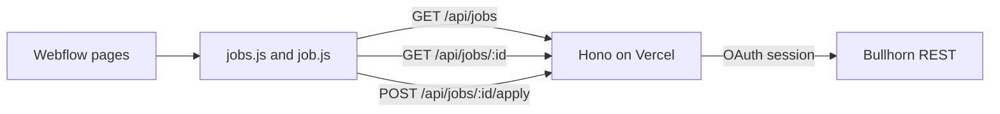

# Career Group Companies careers

pnpm monorepo. Webflow hosts the pages. A Hono API on Vercel reads published Bullhorn jobs and writes applications back.

```
packages/
  frontend/   # scripts loaded on the careers pages
  server/     # Vercel API
```

Bullhorn stays the system of record. Jobs are not copied into a Webflow CMS collection. The browser never calls Bullhorn.



Only jobs a recruiter has published with Actions, then Publish, are returned (`isOpen`, `isPublic`, not deleted). An application becomes one Candidate per email and an internal JobSubmission with status `Web Response`. Applying to ten jobs creates one candidate and ten submissions. A second application to the same job does not create another submission.

The detail link is a stable `?id=` on one Webflow template. It does not change between page loads.

## API

| Route | Method | Purpose |
| --- | --- | --- |
| `/health` | `GET` | `{ "ok": true, "status": "ok" }` |
| `/api/jobs` | `GET` | Published jobs. Optional `q`, `location`, `category`, `start`, `count`. Cached for 5 minutes. |
| `/api/jobs/:id` | `GET` | One published job, including the public description. `404` when it is not published. |
| `/api/jobs/:id/apply` | `POST` | Multipart application. Not cached. |

Apply fields are `firstName`, `lastName`, `email`, `phone`, and an optional `resume` (`pdf`, `doc`, or `docx`, 4 MB). The 4 MB cap stays under Vercel's request body limit. A missing resume is fine. If the resume upload fails after the submission is created, the response is still `{ "ok": true, "resumeAttached": false }`.

`CORS_ORIGINS` is a comma-separated list, or `*`. `careergroupcompanies.com`, `webflow.io`, and their subdomains are still allowed when the list is restricted.

## Bullhorn

The API logs in with the Bullhorn API user (authorize, token exchange, REST login) and keeps the session in memory. Set these in the Vercel project:

```
BULLHORN_CLIENT_ID
BULLHORN_CLIENT_SECRET
BULLHORN_API_USERNAME
BULLHORN_API_PASSWORD
BULLHORN_SUBMISSION_STATUS=Web Response
CORS_ORIGINS=https://www.careergroupcompanies.com,https://careergroupcompanies.com
```

`BULLHORN_CANDIDATE_STATUS` is optional. Leave it empty unless creating a Candidate requires a status value from their picklist.

This uses the standard JobOrder, Candidate, JobSubmission, and file endpoints. It does not use the Bullhorn Open Source Career Portal, and it does not create custom fields.

### Field review before go-live

API access was not available when this was built. The mapped fields are the standard ones set by Publish. Confirm these in the Client corp and change `packages/server/src/bullhorn/fields.ts` if their names differ:

- Publish sets `isPublic` and `publicDescription`.
- The candidate-facing title is `title`.
- Location filters use `address.city`, `address.state`, and `address.countryName`.
- Salary filters use `salary` and `salaryUnit`. Amounts are shown as USD. Hourly, daily, weekly, and monthly salaries are converted to an annual number for the min and max inputs.
- `Web Response` is a valid JobSubmission status.
- New Candidate records do not require extra fields. If they do, their Bullhorn partners add or relax those fields, or set `BULLHORN_CANDIDATE_STATUS`.
- Resume uploads use file type `SAMPLE`.

## Webflow

Load `jobs.js` on the listing page and `job.js` on the detail page. Local dev:

```html
<script>
	window.CAREERS_API_ORIGIN = 'http://localhost:8787';
</script>
<script type="module" src="http://localhost:3000/pages/jobs.js"></script>
```

Production loads the built files from jsDelivr at a pinned commit. The scripts call `https://career-group.vercel.app`. Set `window.CAREERS_API_ORIGIN` on the page only when that host should change without a rebuild.

```html
<script>
	window.CAREERS_API_ORIGIN = 'https://career-group.vercel.app';
</script>
<script
	defer
	src="https://cdn.jsdelivr.net/gh/<org>/<repo>@<commit>/packages/frontend/dist/pages/jobs.js"
></script>
```

Listing markup. `detail-path` is the detail page path. Cards are cloned from the template so the existing layout can stay. Location and salary filters run in the script, not through Finsweet.

```html
<input dev-target="jobs-query" type="search" />
<input dev-target="jobs-location" type="search" />
<select dev-target="jobs-category">
	<option value="">All categories</option>
</select>
<input dev-target="jobs-salary-min" type="number" />
<input dev-target="jobs-salary-max" type="number" />

<template dev-target="job-card-template">
	<a dev-target="job-link" href="#">
		<h3 dev-target="job-title"></h3>
		<p dev-target="job-location"></p>
		<p dev-target="job-category"></p>
		<p dev-target="job-type"></p>
		<p dev-target="job-salary"></p>
	</a>
</template>
<div dev-target="jobs-list" detail-path="/careers/job"></div>
```

Detail markup. The page URL is `/careers/job?id=123` for as long as that job stays published.

```html
<h1 dev-target="job-title"></h1>
<p dev-target="job-location"></p>
<p dev-target="job-type"></p>
<p dev-target="job-category"></p>
<p dev-target="job-salary"></p>
<div dev-target="job-description"></div>

<form dev-target="apply-form">
	<input name="firstName" required />
	<input name="lastName" required />
	<input name="email" type="email" required />
	<input name="phone" />
	<input name="resume" type="file" accept=".pdf,.doc,.docx" />
	<button type="submit">Apply</button>
</form>
<p dev-target="apply-success" class="hide"></p>

<div dev-target="error-wrapper" class="hide">
	<p dev-target="error-text"></p>
	<button type="button" dev-target="cancel">Close</button>
</div>
```

Salary inputs are annual amounts. A job with no salary is hidden once a minimum or maximum is set.

OneTrust must allow jsDelivr and the Vercel API host.

## Local development and deploy

The Vercel project root is `packages/server`. Vercel Pro is enough. An alias is enough to start. Copy `packages/server/.env.example` to `packages/server/.env` for local API credentials.

| Command | Description |
| --- | --- |
| `pnpm dev` | Frontend on port 3000 and API on port 8787 |
| `pnpm test` | API tests |
| `pnpm --filter @career-group/server deploy` | Production deploy of the API |
| `pnpm --filter @career-group/frontend build` | Write `packages/frontend/dist` |

`pnpm dev` serves the same Hono app Node uses locally. Production is that app's default export, which Vercel runs as a Hono project.
