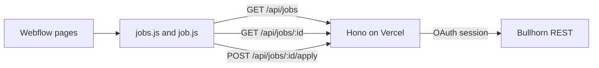

# Career Group Companies careers

pnpm monorepo. Webflow hosts the pages. A Hono API on Vercel reads published Bullhorn jobs and writes applications back.

```
packages/
  frontend/   # scripts loaded on the careers pages
  server/     # Vercel API
```

Bullhorn stays the system of record. Jobs are not copied into a Webflow CMS collection. The browser never calls Bullhorn.



A job is listed when Publishing Status is on, the record is not deleted (`isDeleted:false AND isPublic:1`), and its publish date is not in the future. The publish date is Published Date (`customDate1`), or `dateLastPublished` when that field is empty. A job with no date still lists. Search uses `isPublic:1`. `isPublic:true` matches nothing in this corp. Closed jobs stay on the list when the public flag is still on.

An application becomes one Candidate per email and an internal JobSubmission with status `Web Response`. Applying to ten jobs creates one candidate and ten submissions. A second application to the same job does not create another submission.

The detail link is `?id=` on one Webflow page, by default `/dev/job-posting-dev?id={bullhornJobId}`.

## API

| Route | Method | Purpose |
| --- | --- | --- |
| `/health` | `GET` | `{ "ok": true, "status": "ok" }` |
| `/api/jobs` | `GET` | Published jobs. Optional `q`, `location`, `category`, `near`, `start`, `count`. |
| `/api/jobs/:id` | `GET` | One published job, including the public description. `404` when it is not published. |
| `/api/jobs/:id/apply` | `POST` | Multipart application. Not cached. |

`count` is 1–200, default 50. `start` is 0–10,000. The listing script requests pages of 200 and stops at 500 jobs.

`near` is a city and state, such as `Austin, TX`. The API geocodes it with Google and returns published jobs within 50 miles. The radius is fixed. `GOOGLE_MAPS_API_KEY` stays on the server. An unknown place is `422` with `unresolved_location`. `location` is still an exact city match.

Apply fields are `firstName`, `lastName`, `email`, `phone`, and an optional `resume` (`pdf`, `doc`, or `docx`, 4 MB). The 4 MB cap stays under Vercel's request body limit. A missing resume is fine. If the resume upload fails after the submission is created, the response is still `{ "ok": true, "resumeAttached": false }`.

`CORS_ORIGINS` is a comma-separated list, or `*`. `careergroupcompanies.com`, `webflow.io`, and their subdomains are still allowed when the list is restricted.

## Caching

Job reads are cached in two places. Applications and errors are not.

**Vercel CDN.** `GET /api/jobs` and `GET /api/jobs/:id` send `Cache-Control: public, s-maxage=300, stale-while-revalidate=600`. The edge can serve a response for 5 minutes, then keep serving that copy for another 10 minutes while it fetches a fresh one. There is no `max-age`, so the browser is not told to keep its own copy.

**Server memory.** The Bullhorn client in a warm Node process keeps:

- Each job list, keyed by the query, for 5 minutes.
- Each job detail, keyed by id, for 5 minutes. A missing or unpublished job is not stored.
- The Bullhorn session until 30 seconds before the token expires. It then uses the refresh token, and logs in again only if refresh fails.

That memory cache lives only as long as the server instance. A cold start talks to Bullhorn again. `POST /api/jobs/:id/apply` and every error response use `Cache-Control: no-store`.

## Bullhorn

The API discovers the cluster with `loginInfo`, then logs in (authorize, token exchange, REST login) and keeps the session in memory. The registered redirect URI must be exactly `http://www.bullhorn.com`. Set these in the Vercel project:

```
BULLHORN_CLIENT_ID
BULLHORN_CLIENT_SECRET
BULLHORN_API_USERNAME
BULLHORN_API_PASSWORD
BULLHORN_REDIRECT_URI=http://www.bullhorn.com
BULLHORN_SUBMISSION_STATUS=Web Response
BULLHORN_CANDIDATE_STATUS=New Lead
CORS_ORIGINS=https://www.careergroupcompanies.com,https://careergroupcompanies.com
GOOGLE_MAPS_API_KEY=
```

`BULLHORN_CANDIDATE_STATUS` is sent only when it is set. This corp uses `New Lead`.

This uses the standard JobOrder, Candidate, JobSubmission, and file endpoints. It does not use the Bullhorn Open Source Career Portal, and it does not create custom fields. Resume uploads use file type `SAMPLE`.

### Limits

Bullhorn's ATS API usage limits, per OAuth client id, are 1,500 requests per minute, 100,000 calls per month unless the contract says otherwise, 50 concurrent sessions, and 50 event subscriptions. This integration does not use subscriptions. Over the per-minute cap, Bullhorn returns HTTP 429. This API does not retry those. Their list endpoints document a maximum `count` of 500. This API never asks for more than 200.

### Fields

| Careers value | JobOrder field |
| --- | --- |
| Publishing Status | `isPublic` (search `isPublic:1`) |
| Public title | `customText15`, then `title` |
| Location | `address.city` and the state abbreviation, such as `San Francisco, CA`. A non-US country stays on the line. |
| Employment type | `employmentType` |
| Category | `customText5` (Job Function), then `publishedCategory.name` |
| Annual pay | `customFloat1` min, `customFloat2` max |
| Hourly pay | `payRate` min, `customFloat3` max, used when both annual amounts are empty |
| Hide salary | `customText12` = Yes blanks the amounts |
| Worksite | `customText10`. The card shows `Remote` or `Hybrid`. Onsite and blank stay hidden. |
| Division | `customText20` |
| Posted date | `customDate1`, then `dateLastPublished` |
| Public description | `publicDescription` on the detail page. The card preview is `customText4` when set, otherwise a short plain-text excerpt of `publicDescription`. |

`clientBillRate` is not shown as pay. Division codes: `CG` Career Group, `SB` Syndicatebleu, `FF` Fourth Floor, `CGS` Career Group Search, `CGC` CGC Internal, `Event` or `Events` Career Group Events. An unknown code is shown as stored.

## Webflow

Load `jobs.js` on the listing page and `job.js` on the detail page. Local dev:

```html
<script>
	window.CAREERS_API_ORIGIN = 'http://localhost:8787';
</script>
<script type="module" src="http://localhost:3000/pages/jobs.js"></script>
```

Production loads the built files from jsDelivr at a pinned commit. The scripts call `https://career-group.vercel.app`. Set `window.CAREERS_API_ORIGIN` on the page only when that host should change without a rebuild.

```html
<script>
	window.CAREERS_API_ORIGIN = 'https://career-group.vercel.app';
</script>
<script
	defer
	src="https://cdn.jsdelivr.net/gh/<org>/<repo>@<commit>/packages/frontend/dist/pages/jobs.js"
></script>
```

The first `[dev-target="job-card-item"]` inside `[dev-target="jobs-list"]` is the card template. It is cloned, then removed. `detail-path` on the list overrides the detail page path. The default is `/dev/job-posting-dev`, and the card href is that path plus `?id=`. Filters run in the script. The radius search reads `[dev-target="location-search-input"]`. A partial name such as `CHIC` matches job locations that contain that text. A place Google can resolve, such as `Chicago, IL`, calls `near` and keeps jobs within 50 miles. An empty list opens the error panel with “We could not find your jobs”.

Checkbox and radio rows are cloned from one wrapper each: `search-input`, `location-search-input`, `division-checkbox-wrapper`, `remote-only-checkbox-wrapper`, `employment-type-checkbox-wrapper`, `salary-radio-wrapper`, `job-function-checkbox-wrapper`, and `clear`. Checked values in one group match any of those values. Groups combine. Salary radios are annual minimums from $40,000 to $200,000. Clear Filters restores the loaded list.

Card text is filled through `fs-cmsfilter-field` (`title`, `location`, `type`, `category`, `salary`, `remote`). The division chip is `[dev-target="division-chip"]`. The worksite row is `[dev-target="remote-role"]` and reads Remote or Hybrid. The results line is `[dev-target="results"]` or `.results`, using `fs-cmsfilter-element="results-count"` and `items-count`. A job is marked new when `publishedAt` is on or after local midnight four days ago.

Salary inputs are annual amounts. Hourly jobs are converted with 2,080 hours. A job with no salary is hidden once a minimum or maximum is set. A single hourly rate renders as `$30/hr`. A range renders as `$30/hr–$36/hr`. Yearly amounts have no unit suffix.

Detail markup. The page URL is `/dev/job-posting-dev?id=123` for as long as that job stays published.

```html
<div dev-target="job-highlights" class="job-highlights">
	<p dev-target="job-location"></p>
	<p dev-target="job-salary"></p>
	<p dev-target="job-type"></p>
	<p dev-target="job-category"></p>
	<p dev-target="division"></p>
</div>
<div dev-target="division-card-career-grp" class="division-details"></div>
<div dev-target="division-card-syndicate" class="division-details"></div>
<div dev-target="division-card-fourth-floor" class="division-details"></div>
<div dev-target="division-card-career-grp-search" class="division-details"></div>
<div dev-target="division-card-career-grp-events" class="division-details"></div>
<div dev-target="division-card-career-grp-companies" class="division-details"></div>

<h1 dev-target="job-title"></h1>
<div dev-target="job-description"></div>

<form dev-target="apply-form">
	<input name="firstName" required />
	<input name="lastName" required />
	<input name="email" type="email" required />
	<input name="phone" />
	<input name="resume" type="file" accept=".pdf,.doc,.docx" />
	<button type="submit">Apply</button>
</form>
<p dev-target="apply-success" class="hide"></p>

<div dev-target="error-wrapper" class="hide">
	<p dev-target="error-text"></p>
	<button type="button" dev-target="cancel">Close</button>
</div>
```

On load, `job-highlights` takes the division color and every other division card gets `hide`.

| Division | Color | Card |
| --- | --- | --- |
| Career Group | `#b9373d` | `division-card-career-grp` |
| Syndicatebleu | `#00abc7` | `division-card-syndicate` |
| Fourth Floor | `#51afe2` | `division-card-fourth-floor` |
| Career Group Search | `#bab4ae` | `division-card-career-grp-search` |
| Career Group Events | `#f62dae` | `division-card-career-grp-events` |
| CGC Internal | none | `division-card-career-grp-companies` |

The same colors are used for listing chips. CGC Internal has no chip color.

OneTrust must allow jsDelivr and the Vercel API host.

## Local development and deploy

The Vercel project root is `packages/server`. Vercel Pro is enough. An alias is enough to start. Copy `packages/server/.env.example` to `packages/server/.env` for local API credentials. Do not commit `.env`.

| Command | Description |
| --- | --- |
| `pnpm dev` | Frontend on port 3000 and API on port 8787 |
| `pnpm test` | API tests |
| `pnpm --filter @career-group/server deploy` | Production deploy of the API |
| `pnpm --filter @career-group/frontend build` | Write `packages/frontend/dist` |

`pnpm dev` serves the same Hono app Node uses locally. The API process does not reload on its own, so a server change needs a restart. Production is that app's default export, which Vercel runs as a Hono project. The live API origin is `https://career-group.vercel.app`.
